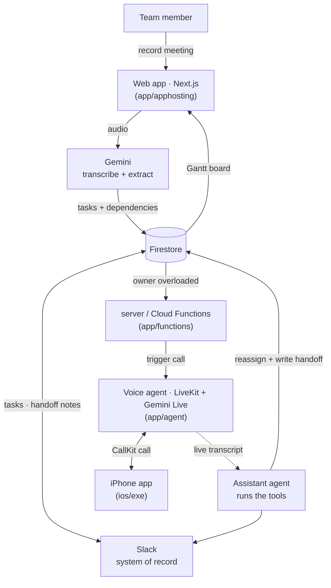

# exe

**Meetings in, moving work out.** exe turns a meeting recording into a live task plan —
and when someone is drowning in work, it *calls their phone* and has an AI agent hand the
work off for them.

## How it works

1. **Record a meeting.** Hit record in the web app (or upload audio); exe transcribes it.
2. **Tasks appear automatically.** From the transcript it extracts tasks *and* their
   dependencies — who owns what, and what blocks what.
3. **See the plan.** Everything lands on a Gantt chart with dependency arrows; drag bars to
   reschedule.
4. **Overloaded? Your phone rings.** When someone is holding too many tasks, exe places a
   real call to their iPhone (CallKit).
5. **The AI agent sorts it out.** It talks the situation through with them and hands tasks
   off to someone who has capacity — complete with an auto-written handoff note.

Slack stays the system of record throughout: tasks, meeting anchors, and handoff notes are
all posted back to the right channels.

## Architecture

Data lives in Firestore; auth is Firebase Auth. Gemini powers transcription and task
extraction; the realtime call runs on Gemini Live (OpenAI realtime optional). Shared logic
sits in `app/packages/*`, and an optional long-term memory service lives in `gbrain/`.

## Splitting the tools out of the call

A realtime voice agent normally **freezes the conversation whenever it makes a tool call** —
the caller hears dead air while the model runs a function. exe avoids that: the voice agent
never calls tools itself. It streams the live transcript to a **separate assistant agent**
(the dotted edge above), which reads the conversation, decides what to do, and runs the
tools in the background — reassigning tasks, writing the handoff note, posting to Slack.
The caller keeps talking to a responsive agent while the real work happens off to the side.

## Running it yourself

Everything is parameterized — no hardcoded project ids, domains, or keys. See **[SETUP.md](SETUP.md)**
for the full initialization guide (Firebase projects, secrets, Slack app, LiveKit VM, iOS).
